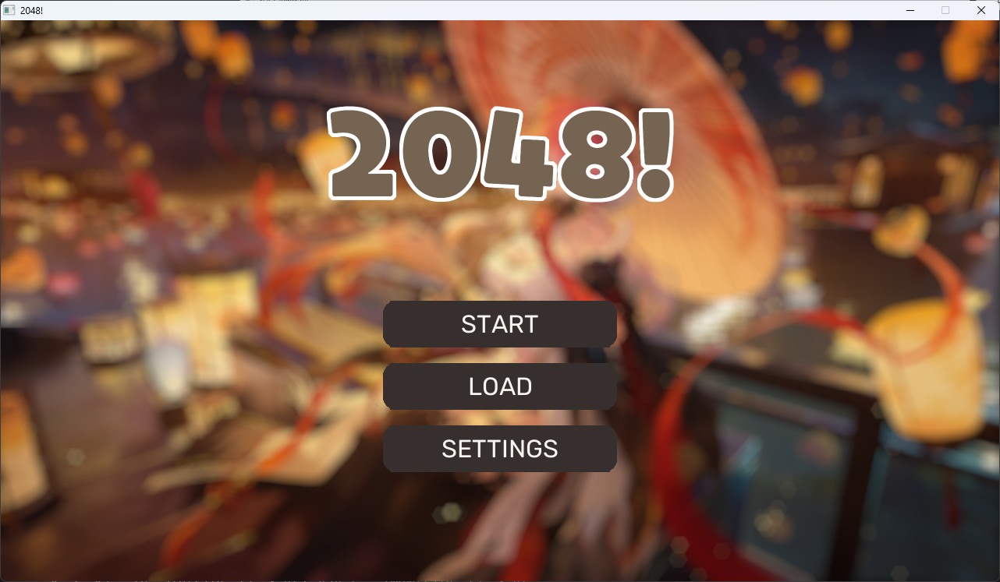
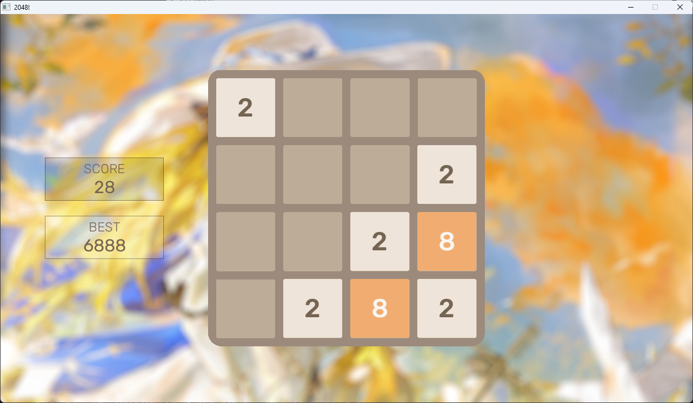

# 2048

This is 2048 built with SDL2 with optional features, written as an assignment for submitting to my university.

## Preview




## Installation

Go to [releases](https://github.com/teppyboy/2048/releases/latest) and download the latest version available for your platform,
if somehow a platform is not available then you can build from source using the tutorial below.

To move the tiles use the WASD key or toggle arrow key support in the game settings.

## Building
To build this game, you must have Meson, Ninja, CMake, make, g++/clang++, SDL2, SDL2_mixer, SDL2_ttf, SDL2_image along with required headers installed.

```bash
git clone https://github.com/teppyboy/2048
cd 2048
meson setup builddir  # Needed for installing SDL2 libraries to the project.
```

+ Debug
```bash
meson compile -C ./builddir
meson install -C ./builddir
```

+ Release
```bash
meson setup builddir-release --buildtype release --optimization 3 --strip
meson compile -C ./builddir-release
meson install -C ./builddir-release
```

The output will be in `./bin`

## Acknowledgements

### BGM
+ Vexento - Lonely Dance: https://soundcloud.com/vexento/vexento-lonely-dance
### SFX
+ Swipe: https://pixabay.com/vi/sound-effects/search/swipe/
### Fonts
+ Rubik: https://fonts.google.com/specimen/Rubik
+ JetBrains Mono: https://www.jetbrains.com/lp/mono/
+ FOT-Yuruka Std (for the logo and some text)
### Images (all are blurred)
+ Main menu background: https://www.pixiv.net/en/artworks/121665267
+ Game background: https://www.pixiv.net/en/artworks/127189078
+ Saves background: https://www.pixiv.net/en/artworks/124283216
+ Settings background: https://www.pixiv.net/en/artworks/123982957
### Assistance
+ StackOverflow
+ Perplexity (with Claude 3.7 Sonnet)

## License

[MIT](./LICENSE)
